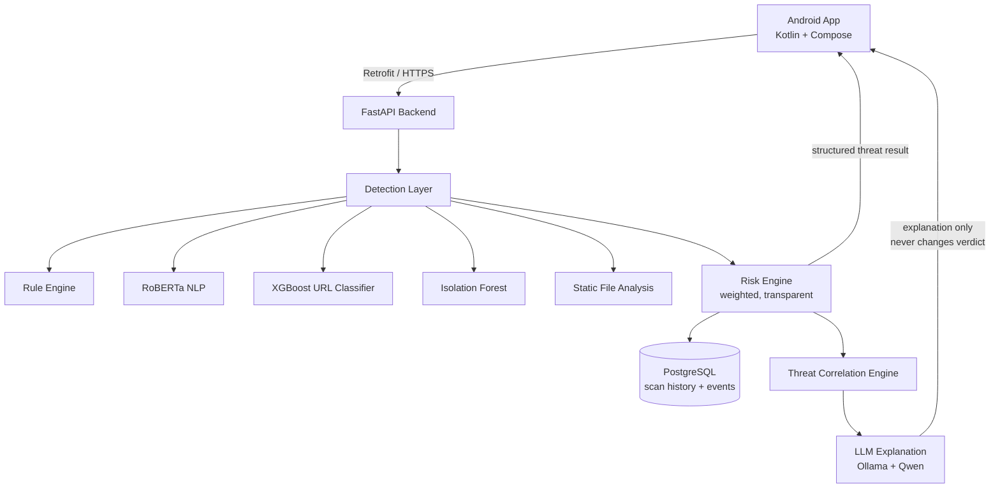

# Architecture

## System Overview



## Core principle: DETECTION vs EXPLANATION

| Layer | Responsibility | Technology |
|---|---|---|
| **Detection** | Decide risk score, severity, classification | Rule Engine, RoBERTa, XGBoost, Isolation Forest, static analysis |
| **Explanation** | Describe the detection in plain language | Ollama (Qwen-family local LLM) |

The LLM receives only structured evidence (`threat_type`, `risk_score`,
`severity`, `indicators`) and **cannot** modify the verdict. If Ollama is
offline, a template explanation is shown and detection continues unaffected.

## Scan pipelines

### Message scan
```
text → preprocess → RoBERTa/fallback classification
     → rule engine (urgency, credentials, rewards, harmful actions)
     → URL extraction → URL analysis per URL
     → Risk Engine (weighted) → persist scan + event
     → Threat Correlation (window + strong pairs + host link)
     → LLM explanation
```

### URL scan
```
url → static feature extraction (19 lexical/structural features, never fetched)
    → XGBoost (if trained) else transparent rule fallback
    → rule evidence → Risk Engine → persist → correlation → LLM
```

### QR scan
```
Camera → ML Kit decode (on-device) → payload triage
      (URL / Wi-Fi / vCard / OTP secret / EMVCo payment)
      → URL analysis if URL → Risk Engine → persist → LLM
```

### File scan
```
file picker → hash (SHA-256) → MIME validation → magic-byte check
            → archive listing (read-only) → PDF metadata flags
            → Risk Engine → persist → LLM
```

## Risk Engine

Weighted combination; missing signals re-normalize so partial analyses stay
fair. Weights come from environment variables (see `.env.example`).

```
risk = Σ (normalized_weight[signal] × value[signal])
     + corroboration boost (2+ independent high signals)
     + small indicator-breadth nudge
```

Severity bands (application-specific calibration, NOT universal standards):
0–24 SAFE · 25–49 LOW · 50–74 MEDIUM · 75–89 HIGH · 90–100 CRITICAL

Every response includes `risk_breakdown` showing each signal's value, weight,
and points — the user can always see why a score was produced.

## Threat correlation

Events within a 30-minute window are ordered by attack-chain position
(SMS scam → phishing URL → suspicious domain → anomalous network activity).
Strong pairs (e.g. scam message + phishing URL) and repeated hosts escalate
the combined risk. Chains and their contributing signals are persisted and
shown on the threat detail screen.

## Model management

| Model | Path (env) | Trained by | Status reporting |
|---|---|---|---|
| RoBERTa | `MODEL_PATH` (app/ml/roberta) | `scripts/train_models.py --roberta` | `/health.nlp_model` |
| XGBoost | `URL_MODEL_PATH` (app/ml/url_model) | `scripts/train_models.py --url` | `/health.url_model` |
| Isolation Forest | `ANOMALY_MODEL_PATH` (app/ml/anomaly_model) | `scripts/train_models.py --anomaly` | `/health.anomaly_model` |
| Qwen LLM | Ollama runtime | `ollama pull qwen2.5:1.5b` | `/health.llm` |

Models are never bundled or auto-downloaded. Without trained artifacts the
services use transparent fallbacks and `/health` says so explicitly.
